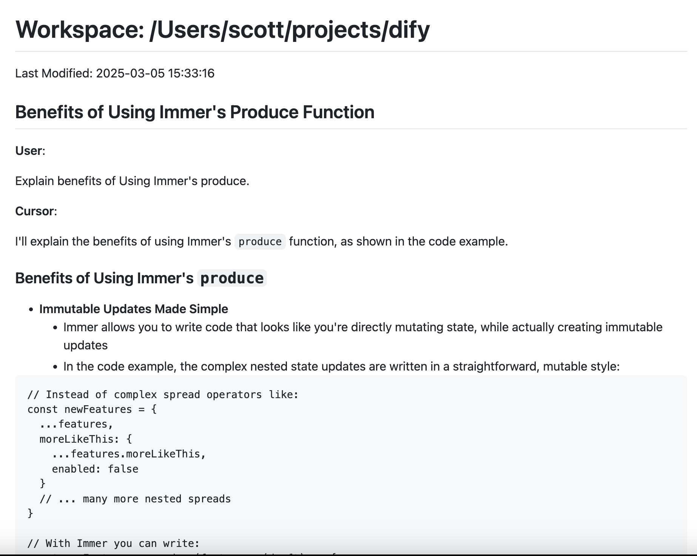

# Cursor Export

A command-line tool to export chat history and composer data from Cursor IDE.

## Installation

```bash
npm install -g cursor-export
```

Or run directly with npx:

```bash
npx cursor-export --workspacePath="/Users/scott/Library/Application Support/Cursor/User/workspaceStorage"

```

## Main Features

- Export Cursor IDE chat history
- Export Composer data

## Usage

```bash
cursor-export [options]

Options:
  -w, --workspacePath  Path to Cursor workspace storage
                       [default: "/Users/scott/Library/Application Support/Cursor/User/workspaceStorage"]
  -h, --help         Show help information

Example Output:

Export completed successfully!
Total workspaces processed: 1
Output directory structure:
cursor-export-output/
  ├── html/
  │   └── <workspace_folders>/
  │       └── <timestamp>--<chat_title>.html
  ├── markdown/
  │   └── <workspace_folders>/
  │       └── <timestamp>--<chat_title>.md
  └── json/
      └── <workspace_name>.json
```

Example html file:



## Quick Start

```bash
# Clone the repository
git clone https://github.com/yourusername/cursor-chat-composer-export.git
cd cursor-chat-composer-export

# Install dependencies
npm install

# Install globally for local testing
npm install -g .

# Run the tool locally
npm start
```

### Project Structure

- `index.js` - Core functionality for exporting chat history
- `cli.js` - Command line interface implementation
- `index.test.js` - Test suite

### Contributing

1. Fork the repository
2. Create your feature branch (`git checkout -b feature/amazing-feature`)
3. Commit your changes (`git commit -m 'Add some amazing feature'`)
4. Push to the branch (`git push origin feature/amazing-feature`)
5. Open a Pull Request

### Debugging

To enable debug logs, set the DEBUG environment variable:

```bash
# On Unix-like systems
DEBUG=cursor-export:* npm start

# On Windows
set DEBUG=cursor-export:* && npm start
```

## License

MIT

## Inspired by cursor-chat-browser

[cursor-chat-browser](https://github.com/thomas-pedersen/cursor-chat-browser)
